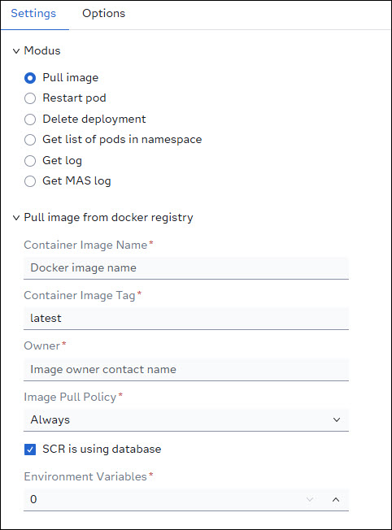
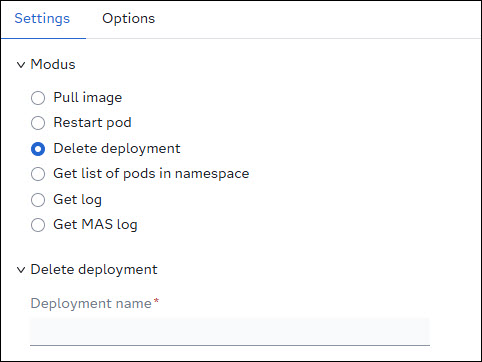
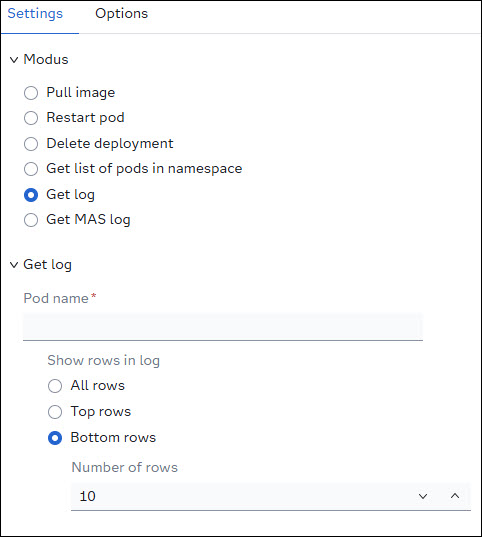

# `k8s-scr-adm`: Service Container for SAS Viya SCR Images
`k8s-scr-adm` is a service container designed to support developers working with SAS Viya by enabling the loading of SAS Container Runtime (SCR) images into Kubernetes. This tool is especially useful during the development phase when decision flows or models are published to a Docker Registry but developers may not have direct access to the Kubernetes cluster.

## Features
Once deployed, the `k8s-scr-adm` container provides a service accessible via custom step *ID - Deploy SCR* in SAS Studio to:

🔷 **Load** SCR images into Kubernetes<br>
🔷 **Restart** launched SCR containers<br>
🔷 **Delete** SCR container deployments<br>
🔷 **List** all pods running in the dedicated Kubernetes namespace<br>
🔷 **Show** log for SCR container<br>

> ⚠️ For security reasons, all SCR containers are loaded into a **single dedicated namespace**.
---

## Installation Guide
> ❗**Note**: By default *k8s-scr-adm* will be installed into namespace ```default```. The default namespace to load the scr containers is ```scr```. Both namespaces can be changed if necessary.

### Create a Dedicated Namespace
`k8s-scr-adm` operates within a single Kubernetes namespace per instance. If you require multiple namespaces, you must deploy separate instances of `k8s-scr-adm`.

If you don't have a dedicated namespace yet, you need to create one. The default namespace to load the scr images is ```scr```. To create a namespace `scr`, run:

```
kubectl create namespace scr
```

### Creating ConfigMaps for k8s-scr-adm
To configure the k8s-scr-adm container, you need to create three ConfigMaps. Follow the steps below to prepare your environment and apply the necessary configurations.

---
#### 1. Prepare the Working Directory
On the server where you access Kubernetes (e.g., via MobaXterm), open a terminal and create a working directory:
```
cd ~
mkdir k8s-scr-adm
cd k8s-scr-adm
```

---
#### 2. Configure k8s-scr-adm
Copy the following file into directory ```~/k8s-scr-adm```:
* [k8s-scr-adm.config](./data/config/k8s-scr-adm.config)

Edit file *k8s-scr-adm.config* to set the required parameters for your *k8s-scr-adm* instance.
| *Name* | *Comment* |
| ---    | ---       |
| BASE_URL | Base endpoint of the *k8s-scr-adm* container. If running multiple instances, assign a unique endpoint per instance <br>***Default:*** /k8s-scr-adm |
| PORT | Target port for the *k8s-scr-adm* container. |
| HOST | External host address (typically the hostname) where *k8s-scr-adm* is accessible. |
| NAMESPACE | Kubernetes namespace dedicated to *k8s-scr-adm*<br>**Default:** scr |
| LIST_SCR | Enables the /list-scr endpoint to display pod statuses in the namespace.<br>***Default:*** False |
| PULL_SCR | Enables the /k8s-scr-adm endpoint to pull images from the Docker registry and load them into Kubernetes.<br>***Default:*** False |
| RESTART_SCR | Enables the /restart-scr endpoint to restart pods.<br>***Default:*** False |
| DELETE_SCR | Enables the /delete-scr endpoint to delete pods and deployments.<br>***Default:*** False |

#### 3. Review scr-template.yaml
Copy the following file into directory ```~/k8s-scr-adm```:
* [scr-template.yaml](./data/config/scr-template.yaml)

The file *scr-template.yaml* is a template used to generate Kubernetes manifests for SCR images. It uses tokens that are replaced at runtime. You may customize this file if needed before creating the ConfigMap.

#### 4. Kubernetes config file
We use the Kubernetes config information from your home directory, assuming the Kubernetes config in is ```$HOME/.kube/config```. If the Kubernetes config file is in a different location you need to change the appropriate command below accordingly.

#### 5. Create ConfigMaps

Format to create a ConfigMap:<br>
```kubectl create configmap <config map name> --from-file=<key>=<file> --namespace=<namespace>```

Use the following commands to create the required ConfigMaps:
>❗**Note**: By default, *k8s-scr-adm* is deployed in namespace```default```. If you use a different namespace, **update the export command** below:

```
# Set the namespace (!!change if needed!!)
export PULL_SCR_NAMESPACE="default"

# Create ConfigMap for k8s-scr-adm configuration
kubectl create configmap k8s-scr-adm-config \
  --from-file=config=$HOME/k8s-scr-adm/k8s-scr-adm.config \
  --namespace=$PULL_SCR_NAMESPACE

# Create ConfigMap for the SCR template
kubectl create configmap scr-yaml-template \
  --from-file=template=$HOME/k8s-scr-adm/scr-template.yaml \
  --namespace=$PULL_SCR_NAMESPACE

# Create ConfigMap for kubectl configuration. 
# Assuming the kubectl config file is in default location in the home directory
kubectl create configmap kubectl-config \
  --from-file=config=$HOME/.kube/config \
  --namespace=$PULL_SCR_NAMESPACE
```
### Load into Kubernetes
#### 1. Create Image Pull Secret
To load *k8s-scr-adm* into Kubernetes, you must first create a Kubernetes secret to pull the SCR image from your Docker registry.

1. Copy the file [scr-secret-docker.yaml](./data/yaml/scr-secret-docker.yaml) to the server directory ```~/k8s-scr-adm```.
    >❗**Note**: If you don't use the default namespace ```scr``` to load the SCR containers you need to change *namespace: scr* in file *scr-secret-docker.yaml* to the correct namespace.

2. Open the file in an editor and replace the placeholder &lt;DOCKER-PULL-SECRET&gt; with your Docker registry credentials.

    **Example: Azure Docker Registry**
    * Update the JSON structure with your registry details:
        ```
        {
            "auths": {
                "<Azure Docker Registry Name>.azurecr.io": {
                "username": "<Azure Docker Registry User Name>",
                "password": "<Azure Docker Registry Password>",
                "auth": "Base64 encode: <username>:<password>"
                }
            }
        }
        ```
    * Base64 encode the auth value: \<username\>:\<password\>:<br>
    Example: sasscr:myPassword → Base64 encode:  c2Fzc2NyOm15UGFzc3dvcmQ=

    * Final JSON structure:
        ```
        {
            "auths": {
                "sasscr.azurecr.io": {
                "username": "sasscr",
                "password": "myPassword",
                "auth": "c2Fzc2NyOm15UGFzc3dvcmQ="
                }
            }
        }
        ```
    * **Base64 encode** the entire JSON structure:
        ```
        ewoJImF1dGhzIjogewoJCSJzYXNzY3IuYXp1cmVjci5pbyI6IHsKCQkJInVzZXJuYW1lIjogInNhc3NjciIsCgkJCSJwYXNzd29yZCI6ICJteVBhc3N3b3JkIiwKCQkJImF1dGgiOiAiYzJGemMyTnlPbTE1VUdGemMzZHZjbVE9IgoJCX0KCX0KfQ==
        ```
    * Replace the token &lt;DOCKER-PULL-SECRET&gt; in ```scr-secret-docker.yaml``` with this encoded string.

    📘 Refer to [Kubernetes documentation](https://kubernetes.io/docs/tasks/configure-pod-container/pull-image-private-registry/#registry-secret-existing-credentials) for more details on creating secrets from existing credentials.

3. Register secret in Kubernetes.
    ```
    cd ~/k8s-scr-adm
    kubectl apply -f scr-secret-docker.yaml
    ```
---
#### 2. Create Database Secret
If the SCR image accesses a database, you must create a database secret. You can skip this step if you are not accessing a database.
1. Copy the file [scr-secret-db.yaml](./data/yaml/scr-secret-db.yaml) to ```~/k8s-scr-adm```
    >❗**Note**: If you don't use the default namespace ```scr``` to load the SCR containers you need to change *namespace: scr* in file *scr-secret-db.yaml* to the correct namespace.

2. Open the file and replace &lt;DB-SECRET&gt; with your database connection string.

    **Example: PostgreSQL Connection**
    * Example connection string:
        ```
        connectionstring=DRIVER=SQL; CONOPTS=(DRIVER=POSTGRES; CATALOG=public; UID=MyUID; PWD=MyPWD; SERVER=MyServer.sas.com; PORT=5432; DB=MyDB;)
        ```
        >💡**Tip:** After the key word *connectionstring=* you can use the same connection string you use with MAS.

    * **Base64 encode** the connection string:
        ```
        Y29ubmVjdGlvbnN0cmluZz1kcml2ZXI9c3FsO2Nvbm9wdHM9KChkcml2ZXI9cG9zdGdyZXM7Y2F0YWxvZz1wdWJsaWM7dWlkPXNhcztwd2Q9J2xueHNhcyc7c2VydmVyPSBwZy1hZ2VudGljLWFpLXBvc3RncmVzcWwuYWdlbnRpYy1haS5zdmMuY2x1c3Rlci5sb2NhbDtwb3J0PTU0MzE7REI9cG9zdGdyZXM7KSk=
        ```

    * Replace the token &lt;DB-SECRET&gt; in file ```scr-secret-db.yaml``` with this encoded string.

    📘 See [Configuring a Database Connection](https://go.documentation.sas.com/doc/en/mascrtcdc/default/mascrtag/n15q5afwsfkjl5n1cfvcn7xz4x22.htm) for information on all supported databases.

3. Register secret in Kubernetes.
    ```
    cd ~/k8s-scr-adm
    kubectl apply -f scr-secret-db.yaml
    ```
---
#### 3. Deploy k8s-scr-adm to Kubernetes
1. Copy the following files to ```~/k8s-scr-adm```:
    * [k8s-scr-adm.yaml](./data/yaml/k8s-scr-adm.yaml)
    * [ns-role.yaml](./data/yaml/ns-role.yaml)<br><br>

    >❗**Note**: If you don't use the default namespace ```scr``` to load the SCR containers you need to change *namespace: scr* in file *ns-role.yaml* to the correct namespace.

    >❗**Note**: By default, *k8s-scr-adm* is deployed in namespace```default```. If you use a different namespace, update *namespace: default* in *k8s-scr-adm.yaml* and *ns-role.yaml* to the correct namespace.

2. Apply the deployment:
    ```
    cd ~/k8s-scr-adm
    kubectl apply -f k8s-scr-adm.yaml
    kubectl apply -f ns-role.yaml 
    ```
3. Verify Deployment<br>
    After applying both files, verify that the *k8s-scr-adm* service is running in Kubernetes.
    ```
    kubectl get pods --namespace default | grep k8s-scr-adm
    ```

---
## ID - Deploy SCR
The **ID - Deploy SCR** custom step allows you to interact with the k8s-scr-adm service from within SAS Viya using SAS Studio. This step supports operations such as:<br>

🔷 **Load** SCR images into Kubernetes<br>
🔷 **Restart** launched SCR containers<br>
🔷 **Delete** SCR container deployments<br>
🔷 **List** all pods running in the dedicated Kubernetes namespace<br>
🔷 **Show** log for SCR container<br>

---
### Importing the Custom Step
To import custom step *ID - Deploy SCR*:
* Open SAS Studio.
* In your home folder (My Folder), create a sub-folder named ```custom steps```.
* Upload file [ID - Deploy SCR.step](./data/custom_step/ID%20-%20Deploy%20SCR.step) into the *custom steps* folder.

---
### User Interface
#### Modus
Use this section to choose the operation you want to perform:

* **Pull Image**<br>
    Load a new SCR image from the Docker registry into Kubernetes.
* **Restart** pod<br>
    Restart a pod, typically after publishing a new version of an SCR image.
* **Delete deployment**<br>
    Remove an SCR deployment from Kubernetes.
* **Get list of pods in namespace**<br>
    Retrieve a list of pods in the *scr-pull* namespace, including status and age information.
* **Get log**<br>
    Retrive the log for a container in the dedicated namespace.



#### Pull image
* **Container Image Name**<br>
The name of the SCR container image in the Docker registry
* **Container Image Tag**<br>
The tag name of the image you want to load. E.g.: latest or 6
* **Owner**<br>
Set a Kubernetes lable for the owner of the scr image. Information who to contact by question about the image
* **Image Pull Policy**,br
Set how the image should get pulled if the pod gets restarted.<br>
Options:
    * Always (default)<br>
    The Kubelet will always attempt to pull the image from the registry every time a container is launched
    * IfNotPresent<br>
    The Kubelet will only pull the image if it is not already present on the node. If a local copy exists, it will be used without checking the registry for updates
    * Never<br>
    It will only use a locally available image. If the image is not found locally, the container launch will fail. This policy is typically used for development or air-gapped environments where images are pre-loaded onto nodes
* **SCR is using database**
    * Tick this box if the SCR image is accessing a database. If this box is ticked a database secret needs to be set. [See Create Database Secret](#2-create-database-secret).    
* **Environment Variables**<br>
Set the number of environment variables you want to set for the scr container
* **Environment Variable**<br>
    * **Name**<br>
    Name of the environment variable
    * **Value**<br>
    Environment variable value

>❗**Note:** The deployment and pod created in Kubernetes are prefixed with **scr-** followed by the image name.<br>
**Example:** For an image named *my-id-flow*, the deployment and pod will be named *scr-my-id-flow*.

---
#### Restart pod


* **Deployment name**<br>
Set the name of the scr deployment you want to re-start.
---

#### Delete deployment


* **Deployment name**<br>
Set the name of the scr deployment you want to delete.
---

#### Get list of pods in namespace


Run the step to receive a list of all pods running in the namespace linked to k8s-scr-adm.

---
#### Get log


* **Pod name**<br>
The name of the pod for wich you want the log information.<br>
You don't need to type in the complete pod name, partions of it will work. E.g.: if the pod name is 'scr-mypod-7b7c55d84b-2fm87' you can just tyep 'mypod'.

* **Show rows in log**
This indecates how many rows on the log will be shows.
    * All rows<br>
    Shows the complete log
    * Top rows<br>
    Show the top number of rows as set in field **Number of rows**
    * Bottom rows<br>
    Show last number of rows as set in field **Number of rows**
<br><br>
---
### Options


Configure the URL for the *k8s-scr-adm* service. The default is:
```
k8s-scr-adm.default.svc.cluster.local
```
If *k8s-scr-adm* is not deployed namespace ```scr```, update the URL using the format:
```
<pod-name>.<namespace>.svc.cluster.local
```
Alternatively, you can set a different URL by setting macro ```PULL_SCR_URL```. This could be done in *SAS Studio Autoexec file*, to automatically set the URL every time you start *SAS Studio*.:
```
%let pull_scr_url= %nrquote(k8s-scr-adm.mynamespace.svc.cluster.local);
```